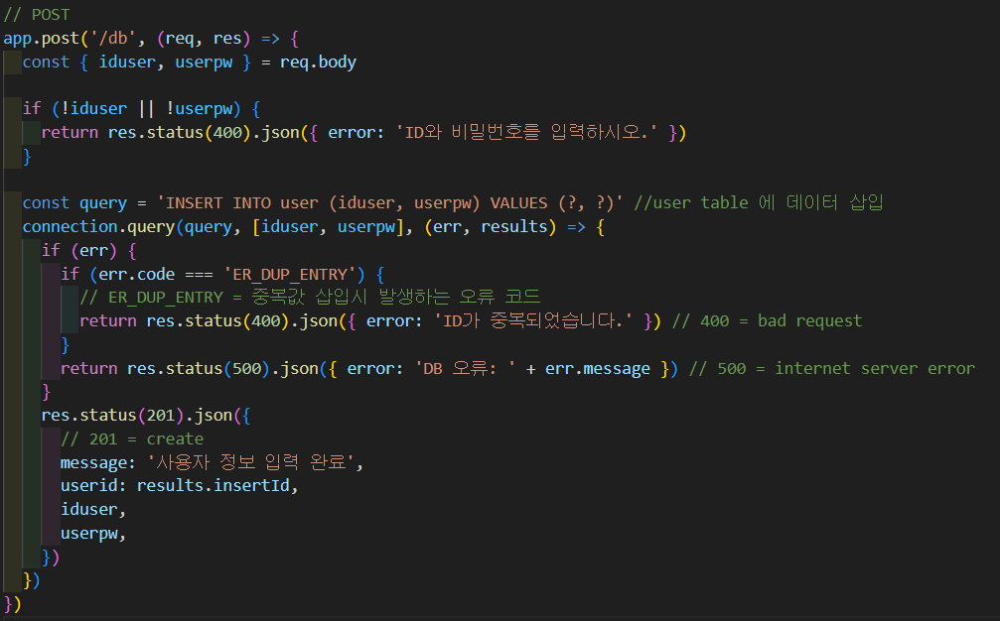
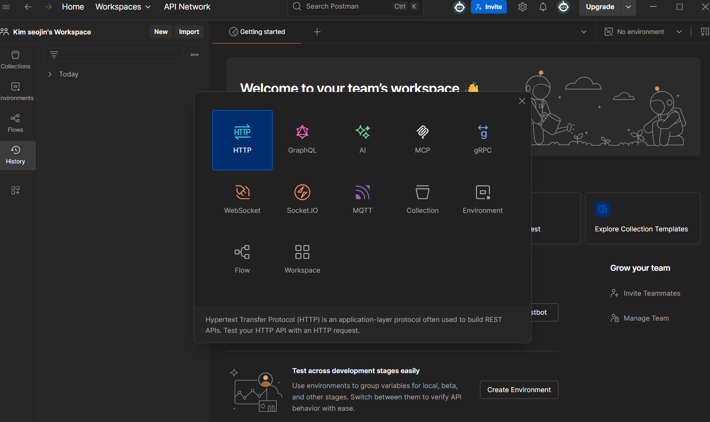
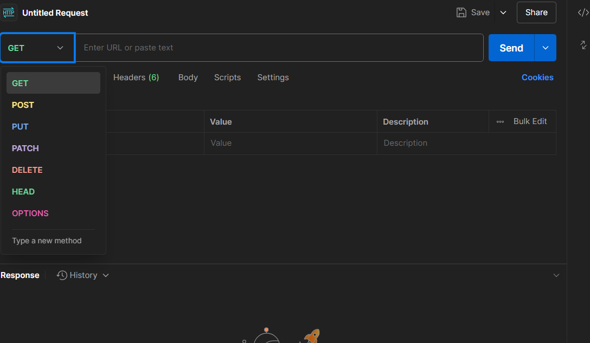
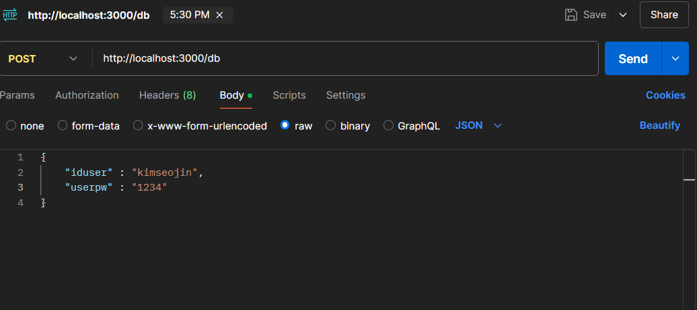
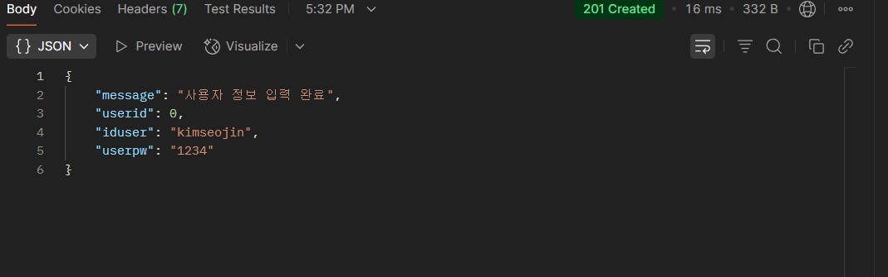
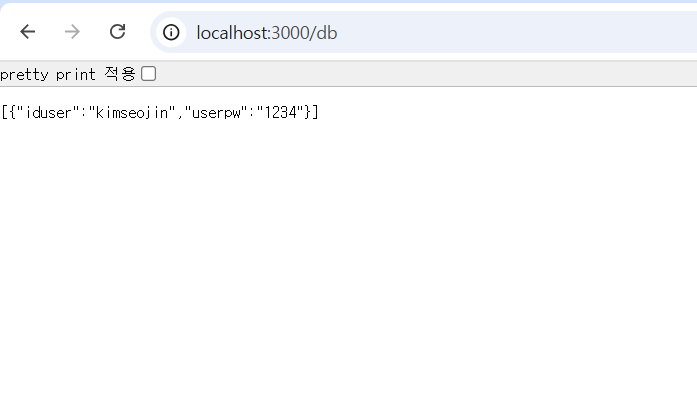

# **제목: mysql과 postman을 활용한 DB 과제**

## **목적: mysql과 postman을 이용한 app.post() 기능으로 ID, PW 저장하기**

---

## **과정 설명**

### **1. DB 생성**

1. **DB 생성하기**

   | DB Create 1                   |
   | ----------------------------- |
   |  |

   - **"Create Schema..." 클릭**

 

2. **DB 이름 작성하기**

   | DB Create 2                   |
   | ----------------------------- |
   |  |

   - **"Name"에 "DB 이름" 입력 및 "Apply" 클릭**

---

### **2. Table 생성**

 

1. **Table 생성하기**

   | Table Create 1                   |
   | -------------------------------- |
   |  |

   - **"Tables"에 우클릭 후 "Create Table" 클릭**

 

2. **Table 설정하기**

   | Table Create 2                   |
   | -------------------------------- |
   |  |

   - **"Table Name"에 "Table 이름" 입력 후 "Column Name"과 "Datatype" 설정 후 "Apply" 클릭**

---

### **3. DB 연결**

 

| DB Connection                    |
| -------------------------------- |
|  |

- **Javascript를 통해 DB와 연결**

---

### **4. post, get 구현**

 

| POST                  |
| --------------------- |
|  |

- **Javascript를 통해 post 기능 구현 및 postman에서 오는 요청 처리**

 

| GET                        |
| -------------------------- |
|  |

- **Javascript를 통해 get 기능 구현**

---

### **5. Postman에서 Post 요청하기**

 

| Postman POST 1            |
| ------------------------- |
|  |

- **"New" 클릭**
- **"HTTP" 클릭**

 

| Postman POST 2            |
| ------------------------- |
|  |

- **"POST" 선택**

 

| Postman POST 3         |
| ---------------------- |
|  |

- 주소창에 `http://localhost:3000/"DB 명"` 입력
- 아래 코드 입력

{

       "iduser": "id입력",
       "userpw": "pw입력"

}

- **"Send" 클릭**

 

| Postman POST 4         |
| ---------------------- |
|  |

- **정상 입력시 출력 결과**

---

### **6. User 데이터 확인**

 

| User 데이터 확인 1    |
| --------------------- |
|  |

- **"node app.js"를 통해 서버 열기**

 

| User 데이터 확인 2   |
| -------------------- |
|  |

- **"http://localhost:3000/db"를 통해 접속 후 User 데이터 확인**

---

### **7. Table 데이터 삭제**

 

| Table delete 1                  |
| ------------------------------- |
|  |

- **삭제할 행 선택 후 "Delete selected rows" 클릭**
- **"Apply" 클릭**

 

| Table delete 2                   |
| -------------------------------- |
|  |

- **해당 창이 뜰 시 "Apply" 클릭 후 "finish" 클릭**

 

| Table delete 3                   |
| -------------------------------- |
|  |

- **http://localhost:3000/db에서 삭제 된 것을 확인 가능**

---

## **요약 및 결과**

 

- **요약**

  - mysql DB 및 Table 생성
  - Javascript에서 post, get 구현
  - Postman을 통해 post 요청
  - Table 정보 삭제 해보기
  - node app.js로 서버 열기 및 테이블 데이터 확인

 

- **결과**
  - 정상적으로 Postman에서 입력한 post 요청이 잘 처리되고 DB Table에 저장 되는 것을 확인 할 수 있었으며 Table 데이터 삭제도 무사히 완료 할 수 있었음.
